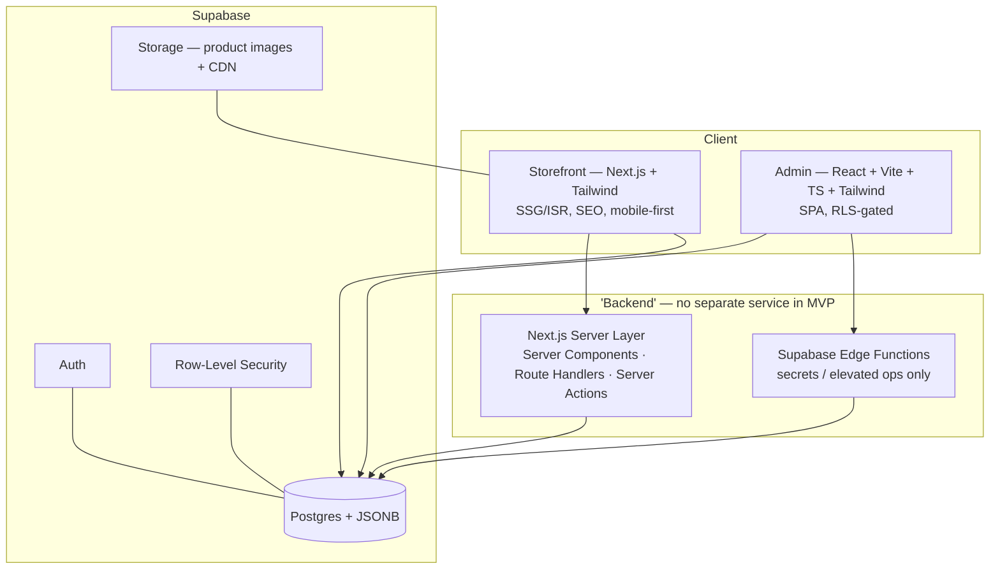
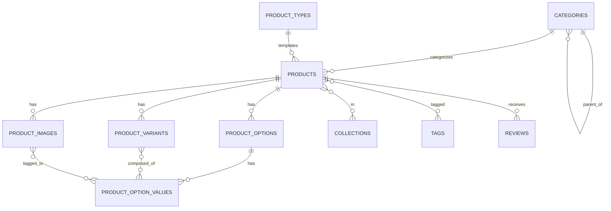
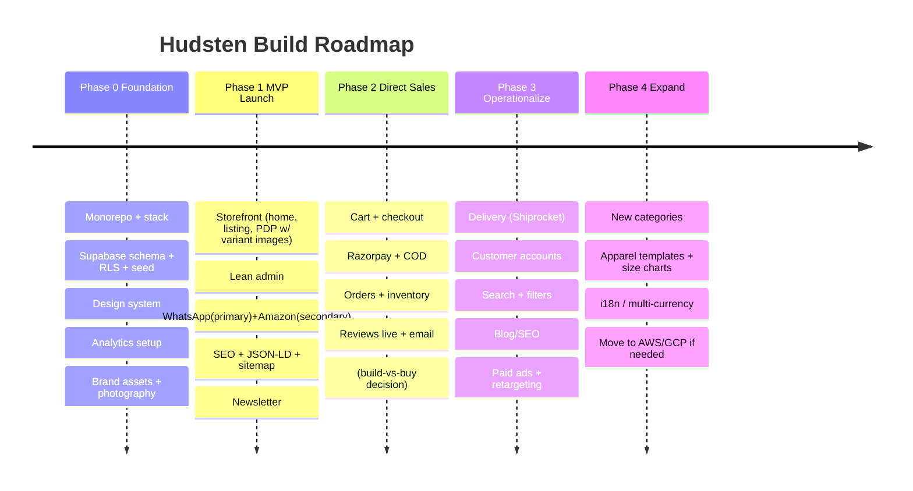

# Hudsten — Product Requirements Document (PRD)

> **Vision:** Build a profitable, scalable fashion & lifestyle brand — starting with gym bags, architected from day one to expand into bags, wallets, leather goods, and apparel without rewrites.
>
> **This document is the single source of truth.** The Claude Code prompt references it directly.

**Optimize every decision for:** Conversion · Trust · Simplicity · Scalability · Ease of Admin · Future Expansion

---

## 1. Core Thesis (read this first)

For a brand-new label, the product page's first job is **to manufacture trust you haven't earned yet** — before it sells anything. We do this with imagery, honest social proof, price anchoring, and risk reversal. Fake reviews and fake countdowns are banned: they're the fastest way to destroy the trust we're building.

**Three foundational decisions** (these prevent the mistakes that kill new stores):

| Decision | Choice | Why |
|---|---|---|
| Build order | **Data model → Storefront → Admin (incremental)** | The data model is the foundation. The storefront makes money. The admin is internal tooling — build it only as operational pain demands. |
| Gender | **An attribute, not a top-level category** | Most future products are unisex. Gender in the structure = duplication & rigidity. As an attribute, "Men"/"Women" nav still works via smart collections. |
| Category vs Collection | **One primary category (structure/SEO) + many collections (merchandising)** | Shopify's model. Clean URLs + flexible selling. Don't force products into one rigid slot. |

---

## 2. Tech Stack



| Layer | Choice | Notes |
|---|---|---|
| Storefront | **Next.js (App Router) + Tailwind** | SSR/SSG/ISR for SEO + speed; `next/image`; mobile-first |
| Admin | **React + Vite + TypeScript + Tailwind** | SPA; no SEO needed; talks to Supabase via SDK |
| DB / Auth / Storage | **Supabase (Postgres)** | JSONB for flexible specs; RLS for security; Storage for images |
| Repo | **pnpm + Turborepo monorepo** | Shared types package removes 2-stack duplication |
| Hosting (start) | Storefront → Vercel · Admin → Vercel/Cloudflare Pages · DB → Supabase | Cheap; portable to AWS/GCP later (it's just Postgres) |
| Payments (Phase 2) | **Razorpay** | India-first; supports UPI/cards/netbanking; Stripe is weak for India domestic |
| Delivery (Phase 3) | **Shiprocket / Delhivery** | Aggregators for India logistics |

**Backend question, answered:** No standalone backend service for MVP. Server logic lives in Next.js Route Handlers/Server Actions + Edge Functions. Add a dedicated service only at Phase 2+ if order orchestration/webhooks demand it.

---

## 3. Product Taxonomy

**Category tree** (structural, drives nav + URLs). Only *Gym Bags* is populated at launch.

```
Bags
 ├─ Gym Bags          ← LAUNCH
 ├─ Backpacks
 ├─ Sling Bags
 ├─ Handbags
 ├─ Travel Bags
 └─ Luggage
Wallets & Leather Accessories
 ├─ Wallets
 └─ Leather Accessories
Apparel
 ├─ Leather Jackets
 └─ T-Shirts
```

- **Gender** = a `gender` attribute on each product (`men | women | unisex`) — **not** a category.
- **Navbar** shows "Men" / "Women" entries that link to **smart collections** filtered by gender. Shoppers get gendered shopping; we avoid structural duplication.
- **Every product** gets exactly **one primary category** (for breadcrumb + canonical URL) and **any number of collections** (for merchandising).

**Launch navbar:**
```
HUDSTEN    [ Gym Bags ▾ ]  [ Men ]  [ Women ]  [ New Arrivals ]        🔍  💬
                 ├ Men's Gym Bags   (smart collection)
                 └ Women's Gym Bags (smart collection)
```

### Guide: adding categories & products later (zero code changes)
**New category:** Admin → Categories → *Create* → set name, slug, parent (optional nesting), SEO fields, position → toggle "show in nav" → Save. Because nav is data-driven, it appears with a toggle, not a deploy.
**New product:** Admin → Products → *Create* → pick **Product Type** (loads the right spec fields) → assign primary category → add to collections → set gender + tags → define options (Color/Size) → generate variants → upload images & tag each to its color → fill specs → set price/compare-at, WhatsApp template, Amazon URL, SEO → Publish.

---

## 4. Data Model (the foundation)



> Convention: every table has `id` (uuid PK), `created_at`, `updated_at`. Only key columns listed below.

**`product_types`** — templates that define which spec fields appear (the expansion mechanism)
| Column | Type | Notes |
|---|---|---|
| name | text | e.g. "Bag", "T-Shirt", "Wallet" |
| spec_schema | jsonb | array of `{key, label, type, unit?, group?}` — drives admin form + PDP rendering |

**`categories`** — hierarchical, structural
| Column | Type | Notes |
|---|---|---|
| name, slug | text | slug unique |
| parent_id | uuid → categories | nullable; self-reference = hierarchy |
| description, image_url | text | |
| meta_title, meta_description | text | SEO (in MVP — cheap now, painful later) |
| position, is_active | int, bool | ordering + visibility |

**`collections`** — flexible, many-to-many merchandising
| Column | Type | Notes |
|---|---|---|
| name, slug | text | |
| type | enum | `manual` \| `smart` |
| rules | jsonb | for smart, e.g. `{gender:'men', category:'gym-bags'}` |
| meta_title, meta_description | text | SEO |
| position, is_active | int, bool | |

**`products`** — core columns shared by all; type-specific specs in JSONB
| Column | Type | Notes |
|---|---|---|
| title, slug | text | slug unique |
| description | text | rich HTML/markdown |
| product_type_id | uuid → product_types | drives spec fields |
| category_id | uuid → categories | **primary** category |
| gender | enum | `men \| women \| unisex` |
| price, compare_at_price | numeric | compare_at = strikethrough anchor |
| currency | text | default `INR` |
| status | enum | `draft \| active \| archived` |
| in_stock | bool | simple MVP stock toggle |
| **specs** | **jsonb** | **flexible per-type attributes — the no-migration expansion mechanism** |
| whatsapp_message_template | text | per-product override (falls back to global) |
| amazon_url | text | nullable |
| is_featured | bool | homepage |
| badges | text[] | New / Bestseller / Limited |
| meta_title, meta_description | text | SEO |
| position | int | |

**`product_options`** → `product_option_values` → `product_variants` (variants composed via join)
| Table | Key columns |
|---|---|
| product_options | product_id, name (`Color`/`Size`), position |
| product_option_values | option_id, value (`Black`/`M`), color_hex (for swatches), position |
| product_variants | product_id, title, sku, price?, compare_at_price?, in_stock, position |
| variant_option_values | variant_id, option_value_id *(which values make the variant)* |

**`product_images`** + **`image_option_values`** ← the variant-image engine
| Table | Key columns | Purpose |
|---|---|---|
| product_images | product_id, url, alt_text, position | gallery |
| **image_option_values** | image_id, option_value_id | **tags an image to a Color value → gallery filters on color select** |

**`tags`** + `product_tags` — for filtering/smart collections (e.g. `leather`, `waterproof`)

**`navigation_menu`** — configurable navbar
| Column | Notes |
|---|---|
| label, position, is_active | |
| link_type | `category \| collection \| url \| dropdown_parent` |
| link_target | slug or URL |
| parent_id | self-reference for dropdowns |

**`settings`** — site config (key/value or single JSON row)
- `whatsapp_number` ✅ (the configurable number) · `whatsapp_default_message_template`
- `store_name`, `logo_url`, `announcement_bar`
- `hero` (jsonb: image, headline, subtext, cta_label, cta_link)
- `featured_collection_id`
- `contact_email`, `phone`, `address`, `gst_number`, social links
- policy page bodies (privacy/terms/shipping/returns)

**`reviews`** (Phase 2-ready, ships empty) · **`newsletter_subscribers`** (lead capture from launch) · **`profiles`** (role: `admin`/`customer` for RLS)

**Deferred to Phase 2 (do not build yet):** `carts`, `cart_items`, `orders`, `order_items`, `customers`, `addresses`, `discounts`, `inventory_levels`, `shipments`.

---

## 5. Site Map (storefront)

```
/                         Home (hero, featured collection, trust strip, newsletter)
/c/[category-slug]        Category / product listing (filters: color, price, gender)
/collections/[slug]       Collection listing
/p/[product-slug]         PRODUCT PAGE  ← conversion engine
/search                   Search (optional in P1)
/about                    Brand / founder story (trust)
/contact                  Contact + WhatsApp
/policies/privacy|terms|shipping|returns
```

**URL structure is locked now** (changing later = redirect hell + lost SEO): `/c/` categories, `/p/` products, `/collections/`.

---

## 6. Product Page Spec (PDP) — mobile-first

```
 MOBILE (primary, ~70%+ of traffic)          DESKTOP
┌──────────────────────────┐         ┌──────────────┬───────────────────┐
│ ☰   HUDSTEN        🔍 💬  │ sticky  │              │  Bestseller · New │
├──────────────────────────┤         │              │  Product Name     │
│  Announcement bar         │         │   [ Image  ] │  ₹2,499 ̶₹̶3̶,̶4̶9̶9̶ -29%│
├──────────────────────────┤         │   gallery    │  ★★★★★ / no reviews│
│                           │         │   ● ○ ○ ○    │ ───────────────── │
│     [  Product Image  ]   │ swipe   │   filters by │  Color ● ● ●       │
│        ● ○ ○ ○            │ gallery │   color      │  Size  S  M  L     │
│                           │         │   + zoom     │ ───────────────── │
├──────────────────────────┤         │   + video    │ ✓ Free shipping   │
│ Bestseller · New          │ badges  │              │ ✓ 7-day returns   │
│ Product Name              │         │              │ ✓ 1-yr warranty   │
│ ₹2,499  ̶₹̶3̶,̶4̶9̶9̶  (-29%)    │ anchor  │              │ [ Order on WA ]   │
│ ★★★★★ (or hidden if none) │ proof   │              │ Prefer Amazon? →  │
├──────────────────────────┤         └──────────────┴───────────────────┘
│ Color: ● ● ●   (swatch →  │         Below fold (both): Description ·
│ Size:  S  M  L  changes   │         Specs (from type) · What's in box ·
│        gallery)           │         FAQ accordion · Reviews · Pairs-with
├──────────────────────────┤
│ ✓ Free ship ✓ Returns     │ trust
│ ✓ Warranty  ✓ Secure      │
├──────────────────────────┤
│ Description ▸             │
│ Specs ▸ (dims, capacity…) │ from product_type
│ What's in the box ▸       │
│ FAQ ▸                     │
│ Reviews ▸ (empty state ok)│
│ Pairs well with →         │ cross-sell
├──────────────────────────┤
│ [   Order on WhatsApp  ]  │ STICKY primary CTA
│   Prefer Amazon? Buy →    │ secondary, smaller
└──────────────────────────┘
```

### Psychology mapping
| Element | Principle |
|---|---|
| Multi-angle + interior + material close-up + **lifestyle/scale shot** + zoom + video | Imagery is the #1 conversion lever for bags |
| `compare_at_price` strikethrough + % off | Price anchoring / value framing |
| Reviews (seeded fast) **or** founder story + specs + warranty as substitutes | Honest social proof / authority — **never fake** |
| Color swatches that swap the gallery | Reduces uncertainty; tactile sense of the product |
| Trust badges near CTA (free ship, 7-day returns, warranty, secure) | **Risk reversal / loss aversion** — kills "what if it's junk?" |
| Specs from product type (dims, capacity, materials, compartments) | Authority + lower cognitive load |
| "Limited first drop" / **real** low-stock count | Scarcity — honest only |
| FAQ accordion (durability, sizing, shipping) | Objection handling |
| "Pairs well with" | AOV uplift |
| Single sticky primary CTA | Hick's Law — one clear action |

### CTA logic (your WhatsApp + Amazon strategy — ranked, not co-equal)
Two equal buttons hurt conversion (split attention). So:
- **Primary = Order on WhatsApp** (large, branded). Protects margin, owns the customer + data, fits Indian behavior.
- **Secondary = "Prefer Amazon? Buy there"** (smaller). Trust fallback for the hesitant; ~15%+ fee + hands Amazon the customer, so it's a crutch, not the default.

**WhatsApp link** = `https://wa.me/<settings.whatsapp_number>?text=<encoded>` where the message **pre-fills product name + selected variant + product URL** (start with context, not "hi"). Number is **configurable in admin**.
**Amazon link** = `product.amazon_url`, opens new tab. **Keep site & Amazon prices consistent** or you erode trust.
**Track both clicks** (GA4 events) from day one — learn which channel converts before investing in a gateway.

### Variant images (your differentiator — Shopify fumbles this)
- Tag images to the **Color** option-value (`image_option_values`), since color drives the gallery and size doesn't.
- On color select: gallery filters to that color's images; size selection doesn't disturb it.
- **Preload all color sets** (instant, no flicker), **preserve the viewing angle/index** across switch, **fall back** to product-level images if a color has none.

### Product-specific PDP fields (per `product_type` → stored in `specs` JSONB)
**Bags:** dimensions (L×W×H), weight, capacity (L), materials (leather/lining/hardware), compartments & pockets, laptop-sleeve fit, care, color/marketing name, warranty, country/"handcrafted in…", what's in the box, key-feature bullets, video URL, FAQ, related products, badges.
**Later (auto via templates):** T-shirts → fabric/GSM, fit, size chart · Wallets → card slots · Jackets → fit. **No schema migration needed.**

---

## 7. Admin Panel (lean — Shopify-inspired)

```
HUDSTEN ADMIN
├─ Dashboard       counts + quick links (keep light)
├─ Products        list → edit: info · options/variants · image uploader w/ color-tagging
│                  · specs form (rendered from product_type) · SEO · WhatsApp/Amazon
├─ Categories      tree · nest · reorder · SEO
├─ Collections     manual / smart · assign products
├─ Product Types   define spec fields per type (the expansion control)
├─ Navigation      drag-and-drop menu builder
└─ Settings        WhatsApp # · hero · featured · contact/GST · social · policies
─────────────────────────────────────────────────────────────
[Phase 2+]  Orders · Discounts · Reviews moderation · Customers · Analytics
```

**Editable in MVP admin:** everything on the PDP and nav/home is editable — product fields, variants, images, specs, SEO, per-product CTAs, categories, collections, product types, navbar, hero, featured, WhatsApp number, contact/GST, policy text.

**Deliberately deferred (tell engineers NOT to build yet):** inventory counts, coupon engine, payment gateway, order management, shipping integration, customer accounts/CRM, review moderation UI, analytics dashboards, blog/CMS, abandoned-cart, multi-currency. *Not building these is what keeps the MVP simple.*

**Pulled INTO MVP** (cheap now, painful later): per-product/category **SEO fields**.

**Security of admin:** Supabase Auth + `profiles.role = admin`; RLS grants write only to admins; public gets read-only on active records. Anything needing the **service-role key or secrets runs server-side only** (Edge Functions / Route Handlers) — never in the React bundle. 2FA when feasible.

---

## 8. Roadmap (small phases)



| Phase | Goal | In | Out (yet) | Exit criteria |
|---|---|---|---|---|
| **0** | Foundation | Repo, stack, **DB schema + RLS + seed**, design tokens, analytics setup, photos | features | Skeleton + DB + types generated |
| **1** | **Validate demand** | Storefront (home/listing/PDP/policies/newsletter), lean admin, WhatsApp+Amazon, SEO basics, analytics live | cart, payments, accounts | Live site; CTAs work + tracked; admin CRUD works |
| **2** | Monetize directly | Cart, checkout, **Razorpay + COD**, orders, real inventory, discounts, reviews live, email | delivery API | First on-site order paid |
| **3** | Operationalize & grow | Delivery integration, accounts, search/filters, blog, paid-ads + retargeting | — | Automated fulfilment |
| **4** | Expand catalog | New categories via templates, apparel size charts, i18n, infra move | — | 2nd+ category live |

**Phase 2 build-vs-buy fork (honest):** building cart/checkout/orders means reinventing commerce primitives Medusa.js gives free. Re-evaluate adopting Medusa at Phase 2. Phase 1 (catalog + external buy buttons) is correctly built directly on Supabase.

---

## 9. Cross-Cutting Requirements

**SEO (from launch)**
- Server-rendered pages (SSG/ISR), clean locked URLs, per-product/category meta.
- **Structured data:** `Product`, `Offer`, `BreadcrumbList`, `AggregateRating` (when reviews exist).
- `sitemap.xml` + `robots.txt`, canonical tags, OpenGraph/Twitter cards.

**Performance / Core Web Vitals** — affects ranking *and* conversion
- `next/image` + CDN + AVIF/WebP + lazy-load (bags are image-heavy). Treat image optimization as non-negotiable.
- ISR for catalog pages; minimize JS; preload variant image sets.

**Security** (even pre-payments)
- HTTPS, secure headers, input validation (zod), rate-limit WhatsApp/contact/newsletter forms, bot/scrape protection.
- RLS everywhere; service-role key server-side only; hardened admin auth + 2FA.

**Analytics** (day one)
- GA4 + **Meta Pixel** (retargeting data ready for ad-scale), event tracking on WhatsApp & Amazon clicks + `view_item`.
- Cookie-consent banner.

**Trust & legal pages** — quietly do conversion work
- Privacy, Terms, Shipping, Returns/Refund; real contact, **physical address, GST number** (India trust signal).

**Lead capture** — newsletter signup from launch (owned asset, survives algorithm changes).

---

## 10. What You Were Missing (added by the team)

| Item | Why it matters |
|---|---|
| **Razorpay** (not Stripe) for P2 | India-first payments (UPI/cards/netbanking) |
| **Cash on Delivery** | Huge in India; handle manually via WhatsApp in P1, build into checkout in P2 |
| **GST display + invoicing** | Legal + trust; needed once selling on-site |
| **RTO (return-to-origin) cost awareness** | Major hidden cost in Indian ecommerce ops |
| **WhatsApp: click-to-chat now → Business API later** | `wa.me` is free & simple for P1; API adds automation/catalog later |
| **Photography & brand assets** | The single biggest PDP conversion lever for bags — budget for it |
| **Staging environment + DB backups** | Don't test in production; protect data |
| **a11y basics** (alt text, contrast, keyboard) | Reach + SEO + legal hygiene |
| **Wishlist** (P3) | Strong for fashion repeat-visits |
| **Domain + business email + legal entity/GST registration** | Operational prerequisites |

---

## 11. Open Decisions

1. **Phase 2 commerce engine:** stay on Supabase vs adopt Medusa.js — decide when building checkout.
2. **Image pipeline:** Supabase Storage transforms (MVP) vs Cloudinary/imgix (scale).
3. **Search:** Postgres full-text (MVP) vs Algolia/Typesense (scale).
4. **Infra move:** stay on Vercel+Supabase until scale/cost justifies AWS/GCP.

---
*End of PRD. Implementation specifics and guardrails live in the Claude Code prompt.*
